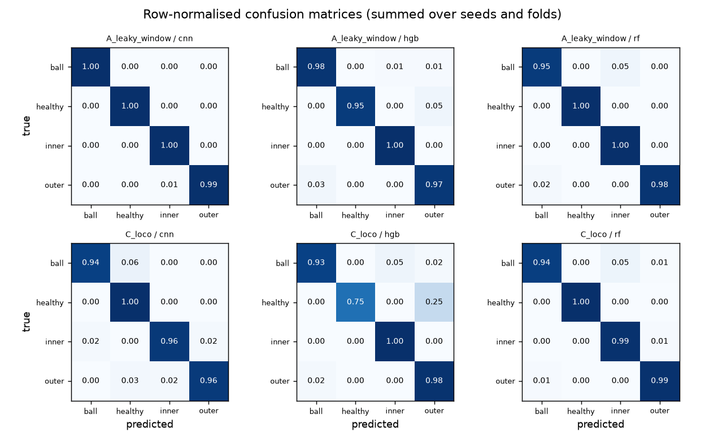

# Results

- Data: `cwru`, 640 windows, fs=12000.0 Hz, window=2048, stride=1024, channels=['vibration_de']
- Raw data manifest sha256: `8f89fbdec55271470cba523029eb8ce10ff479620baeea47617ea5a7fac51e19`
- Code version: `d0eaaa3`; run 2026-09-25T13:09:51+00:00 → 2026-09-25T13:10:50+00:00
- Seeds: (0, 1, 2, 3, 4). Cells are macro-F1, mean ± sample std over seeds (scenario C: mean of its folds within each seed).

## Macro-F1 by scenario and model

| Scenario | cnn | hgb | rf |
|---|---|---|---|
| A: random windows (**leaky, deliberately**) | 0.998 ± 0.002 | 0.979 ± 0.022 | 0.984 ± 0.008 |
| C: leave one operating condition out | 0.952 ± 0.016 | 0.908 ± 0.000 | 0.980 ± 0.002 |

## Per-class recall (mean over seeds and folds)

| Scenario | Model | ball | healthy | inner | outer |
|---|---|---|---|---|---|
| A_leaky_window | cnn | 1.000 | 1.000 | 1.000 | 0.993 |
| A_leaky_window | hgb | 0.979 | 0.958 | 1.000 | 0.968 |
| A_leaky_window | rf | 0.954 | 1.000 | 1.000 | 0.979 |
| C_loco | cnn | 0.935 | 1.000 | 0.961 | 0.958 |
| C_loco | hgb | 0.932 | 0.750 | 1.000 | 0.984 |
| C_loco | rf | 0.943 | 1.000 | 0.989 | 0.989 |

## Scenario C by held-out condition (macro-F1, mean ± std over seeds)

| Held-out condition | cnn | hgb | rf |
|---|---|---|---|
| load_0hp | 0.856 ± 0.053 | 0.699 ± 0.000 | 0.977 ± 0.009 |
| load_1hp | 0.999 ± 0.002 | 0.979 ± 0.000 | 0.995 ± 0.000 |
| load_2hp | 1.000 ± 0.000 | 1.000 ± 0.000 | 0.990 ± 0.000 |
| load_3hp | 0.952 ± 0.029 | 0.953 ± 0.000 | 0.958 ± 0.000 |

## Error analysis: 15 worst test bearings (first seed)

Full table: `error_analysis.csv` (per bearing and condition).

| Scenario | Model | Bearing | True class | Accuracy |
|---|---|---|---|---|
| C_loco | hgb | cwru-healthy-0.000 | healthy | 0.75 |
| C_loco | cnn | cwru-ball-0.021 | ball | 0.78 |
| C_loco | hgb | cwru-ball-0.014 | ball | 0.88 |
| C_loco | rf | cwru-ball-0.014 | ball | 0.88 |
| A_leaky_window | rf | cwru-ball-0.014 | ball | 0.92 |
| C_loco | hgb | cwru-ball-0.021 | ball | 0.92 |
| A_leaky_window | hgb | cwru-ball-0.021 | ball | 0.94 |
| C_loco | rf | cwru-ball-0.021 | ball | 0.95 |
| C_loco | hgb | cwru-outer-0.014 | outer | 0.95 |
| C_loco | rf | cwru-inner-0.021 | inner | 0.97 |
| C_loco | rf | cwru-outer-0.014 | outer | 0.97 |
| C_loco | cnn | cwru-inner-0.014 | inner | 0.98 |
| C_loco | cnn | cwru-outer-0.021 | outer | 1.00 |
| A_leaky_window | cnn | cwru-ball-0.007 | ball | 1.00 |
| C_loco | cnn | cwru-inner-0.021 | inner | 1.00 |

## Confusion matrices

