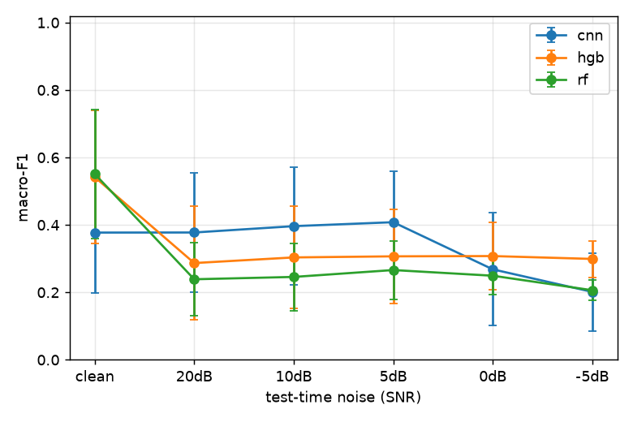
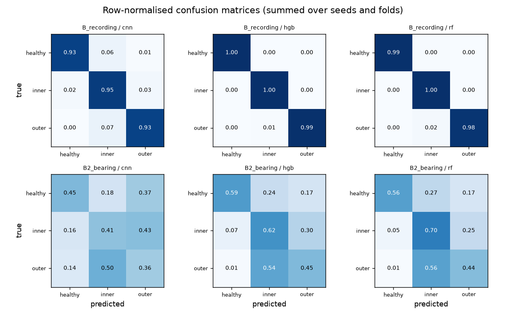

# Results

- Data: `paderborn`, 37104 windows, fs=32000.0 Hz, window=4096, stride=2048, channels=['vibration_1', 'phase_current_1', 'phase_current_2']
- Raw data manifest sha256: `43bdbcc38a068740df4fe7393ecd0d66bb38e26c27de2b1b4a30124c9911a2d8`
- Code version: `d0eaaa3`; run 2026-09-25T12:43:24+00:00 → 2026-09-25T13:09:49+00:00
- Seeds: (0, 1, 2, 3, 4). Cells are macro-F1, mean ± sample std over seeds (scenario C: mean of its folds within each seed).

## Macro-F1 by scenario and model

| Scenario | cnn | hgb | rf |
|---|---|---|---|
| B: recording-level split | 0.939 ± 0.030 | 0.995 ± 0.001 | 0.990 ± 0.002 |
| B2: bearing-level split | 0.377 ± 0.178 | 0.542 ± 0.198 | 0.551 ± 0.191 |

## Per-class recall (mean over seeds and folds)

| Scenario | Model | healthy | inner | outer |
|---|---|---|---|---|
| B_recording | cnn | 0.933 | 0.953 | 0.927 |
| B_recording | hgb | 0.997 | 0.996 | 0.993 |
| B_recording | rf | 0.994 | 0.997 | 0.980 |
| B2_bearing | cnn | 0.450 | 0.411 | 0.365 |
| B2_bearing | hgb | 0.585 | 0.623 | 0.449 |
| B2_bearing | rf | 0.563 | 0.702 | 0.437 |

## Noise robustness (B2_bearing, macro-F1)

White Gaussian noise added to test windows only.

| Model | clean | 20dB | 10dB | 5dB | 0dB | -5dB |
|---|---|---|---|---|---|---|
| cnn | 0.377 ± 0.178 | 0.378 ± 0.177 | 0.396 ± 0.174 | 0.408 ± 0.150 | 0.268 ± 0.167 | 0.201 ± 0.116 |
| hgb | 0.542 ± 0.198 | 0.287 ± 0.169 | 0.304 ± 0.151 | 0.307 ± 0.140 | 0.308 ± 0.099 | 0.299 ± 0.054 |
| rf | 0.551 ± 0.191 | 0.239 ± 0.109 | 0.246 ± 0.099 | 0.266 ± 0.086 | 0.249 ± 0.057 | 0.206 ± 0.030 |

## Latency and size (single window, CPU, this machine)

| Model | p50 ms | p95 ms | Size on disk | Parameters |
|---|---|---|---|---|
| cnn | 0.30 | 0.31 | 103 KiB | 23763 |
| hgb | 13.97 | 15.95 | 1920 KiB | – |
| rf | 18.29 | 20.27 | 22974 KiB | – |

## Error analysis: 15 worst test bearings (first seed)

Full table: `error_analysis.csv` (per bearing and condition).

| Scenario | Model | Bearing | True class | Accuracy |
|---|---|---|---|---|
| B2_bearing | cnn | KI05 | inner | 0.00 |
| B2_bearing | rf | K005 | healthy | 0.00 |
| B2_bearing | hgb | K005 | healthy | 0.00 |
| B2_bearing | hgb | K004 | healthy | 0.00 |
| B2_bearing | cnn | KI04 | inner | 0.00 |
| B2_bearing | cnn | KI01 | inner | 0.00 |
| B2_bearing | rf | K004 | healthy | 0.00 |
| B2_bearing | cnn | KA15 | outer | 0.00 |
| B2_bearing | cnn | KA03 | outer | 0.00 |
| B2_bearing | cnn | KA22 | outer | 0.00 |
| B2_bearing | cnn | K005 | healthy | 0.00 |
| B2_bearing | cnn | K004 | healthy | 0.00 |
| B2_bearing | hgb | KA03 | outer | 0.01 |
| B2_bearing | rf | KA15 | outer | 0.03 |
| B2_bearing | hgb | KA15 | outer | 0.10 |

## Confusion matrices

