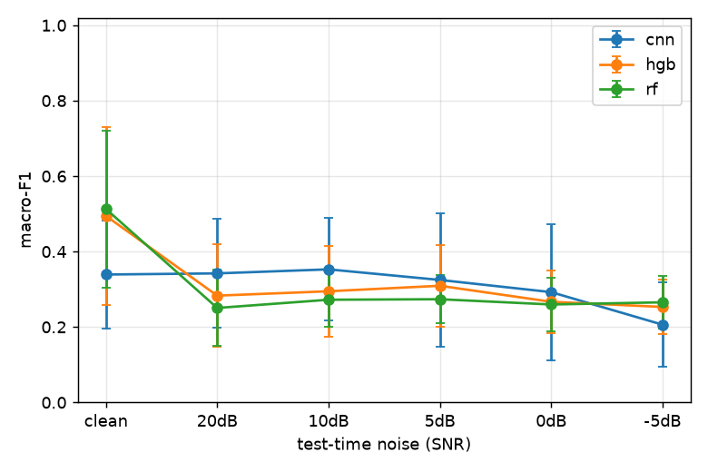
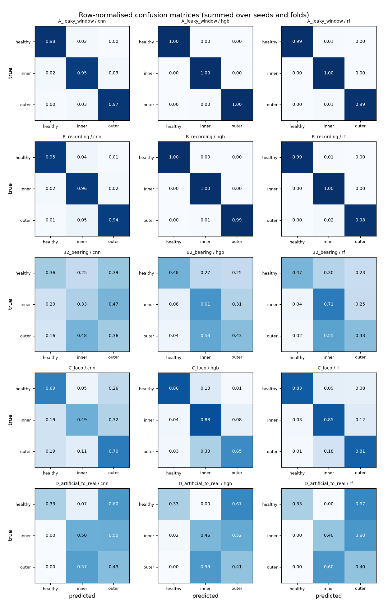

# Results

- Data: `paderborn`, 37104 windows, fs=16000.0 Hz, window=2048, stride=1024, channels=['vibration_1', 'phase_current_1', 'phase_current_2']
- Raw data manifest sha256: `43bdbcc38a068740df4fe7393ecd0d66bb38e26c27de2b1b4a30124c9911a2d8`
- Code version: `d0eaaa3`; run 2026-09-25T11:48:23+00:00 → 2026-09-25T12:43:22+00:00
- Seeds: (0, 1, 2, 3, 4). Cells are macro-F1, mean ± sample std over seeds (scenario C: mean of its folds within each seed).

## Macro-F1 by scenario and model

| Scenario | cnn | hgb | rf |
|---|---|---|---|
| A: random windows (**leaky, deliberately**) | 0.964 ± 0.008 | 0.997 ± 0.001 | 0.992 ± 0.000 |
| B: recording-level split | 0.950 ± 0.016 | 0.995 ± 0.001 | 0.990 ± 0.002 |
| B2: bearing-level split | 0.339 ± 0.142 | 0.495 ± 0.236 | 0.513 ± 0.208 |
| C: leave one operating condition out | 0.561 ± 0.024 | 0.779 ± 0.000 | 0.832 ± 0.005 |
| D: train artificial damage, test real damage | 0.451 ± 0.012 | 0.429 ± 0.000 | 0.412 ± 0.002 |

## Per-class recall (mean over seeds and folds)

| Scenario | Model | healthy | inner | outer |
|---|---|---|---|---|
| A_leaky_window | cnn | 0.978 | 0.950 | 0.969 |
| A_leaky_window | hgb | 0.998 | 0.997 | 0.996 |
| A_leaky_window | rf | 0.992 | 0.996 | 0.986 |
| B_recording | cnn | 0.951 | 0.956 | 0.944 |
| B_recording | hgb | 0.997 | 0.996 | 0.993 |
| B_recording | rf | 0.991 | 0.995 | 0.983 |
| B2_bearing | cnn | 0.357 | 0.328 | 0.361 |
| B2_bearing | hgb | 0.479 | 0.609 | 0.430 |
| B2_bearing | rf | 0.468 | 0.710 | 0.428 |
| C_loco | cnn | 0.688 | 0.492 | 0.704 |
| C_loco | hgb | 0.857 | 0.879 | 0.646 |
| C_loco | rf | 0.829 | 0.845 | 0.809 |
| D_artificial_to_real | cnn | 0.330 | 0.498 | 0.432 |
| D_artificial_to_real | hgb | 0.333 | 0.460 | 0.405 |
| D_artificial_to_real | rf | 0.334 | 0.395 | 0.403 |

## Scenario C by held-out condition (macro-F1, mean ± std over seeds)

| Held-out condition | cnn | hgb | rf |
|---|---|---|---|
| N09_M07_F10 | 0.255 ± 0.086 | 0.487 ± 0.000 | 0.685 ± 0.011 |
| N15_M01_F10 | 0.437 ± 0.096 | 0.747 ± 0.000 | 0.785 ± 0.007 |
| N15_M07_F04 | 0.703 ± 0.018 | 0.904 ± 0.000 | 0.905 ± 0.002 |
| N15_M07_F10 | 0.850 ± 0.025 | 0.980 ± 0.000 | 0.954 ± 0.008 |

## Noise robustness (B2_bearing, macro-F1)

White Gaussian noise added to test windows only.

| Model | clean | 20dB | 10dB | 5dB | 0dB | -5dB |
|---|---|---|---|---|---|---|
| cnn | 0.339 ± 0.142 | 0.342 ± 0.144 | 0.353 ± 0.136 | 0.325 ± 0.178 | 0.292 ± 0.181 | 0.206 ± 0.112 |
| hgb | 0.495 ± 0.236 | 0.283 ± 0.136 | 0.295 ± 0.121 | 0.309 ± 0.108 | 0.267 ± 0.084 | 0.253 ± 0.072 |
| rf | 0.513 ± 0.208 | 0.250 ± 0.102 | 0.272 ± 0.072 | 0.274 ± 0.063 | 0.260 ± 0.072 | 0.266 ± 0.071 |

## Latency and size (single window, CPU, this machine)

| Model | p50 ms | p95 ms | Size on disk | Parameters |
|---|---|---|---|---|
| cnn | 0.27 | 0.28 | 103 KiB | 23763 |
| hgb | 13.63 | 15.52 | 2038 KiB | – |
| rf | 17.88 | 28.75 | 27185 KiB | – |

## Error analysis: 15 worst test bearings (first seed)

Full table: `error_analysis.csv` (per bearing and condition).

| Scenario | Model | Bearing | True class | Accuracy |
|---|---|---|---|---|
| D_artificial_to_real | rf | KI21 | inner | 0.00 |
| D_artificial_to_real | hgb | K005 | healthy | 0.00 |
| D_artificial_to_real | rf | KA16 | outer | 0.00 |
| D_artificial_to_real | hgb | K004 | healthy | 0.00 |
| D_artificial_to_real | hgb | KI14 | inner | 0.00 |
| D_artificial_to_real | cnn | KI16 | inner | 0.00 |
| B2_bearing | rf | K005 | healthy | 0.00 |
| D_artificial_to_real | rf | K004 | healthy | 0.00 |
| B2_bearing | rf | K004 | healthy | 0.00 |
| D_artificial_to_real | hgb | KI21 | inner | 0.00 |
| B2_bearing | hgb | K005 | healthy | 0.00 |
| D_artificial_to_real | rf | KI14 | inner | 0.00 |
| B2_bearing | hgb | K004 | healthy | 0.00 |
| D_artificial_to_real | cnn | K004 | healthy | 0.00 |
| D_artificial_to_real | rf | KA04 | outer | 0.00 |

## Confusion matrices

